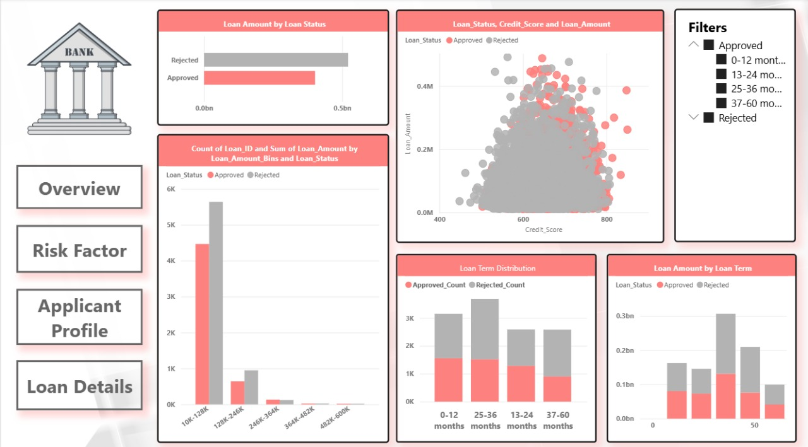
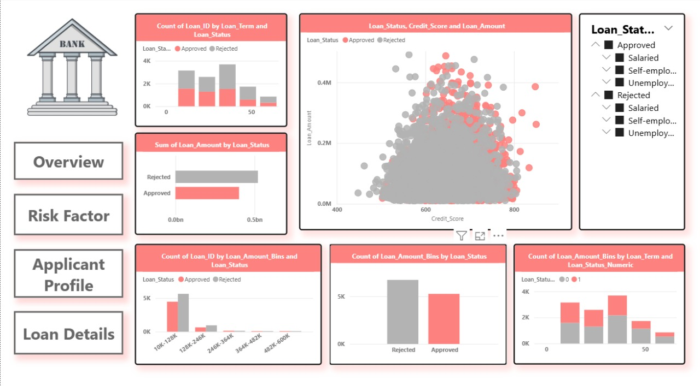

# Loan Analytics Project – Risk and Approval Insights

This project provides a comprehensive analysis of a bank’s loan application dataset to extract key patterns and insights related to approval rates, income segments, risk profiles, and demographic behavior. The project integrates Python for data processing, MySQL for structured querying, and Power BI for building interactive visual dashboards that support data-driven decision-making.

---

## Project Objective

The primary goal is to uncover business-critical insights from historical loan data that can help in understanding approval patterns, identifying risky applicants, and supporting strategic lending decisions.

---

## Tools and Technologies

- **Python (Pandas, NumPy, Matplotlib, Seaborn)** – For data wrangling, exploration, visualization, and feature engineering.
- **MySQL** – For storing cleaned data and creating reusable SQL views to answer key business questions.
- **Power BI** – To build interactive dashboards with filters, KPIs, and visual summaries for stakeholder reporting.
- **Jupyter Notebook** – For step-by-step analysis and data storytelling.
- **Git & GitHub** – For version control and project management.

---

## Project Workflow

### 1. Data Preparation

- Raw data was loaded, inspected, and cleaned using Python.
- Missing and inconsistent entries were identified and handled.
- New features such as debt-to-income ratio were created to enhance analysis.
- The cleaned dataset was exported to CSV for use across MySQL and Power BI.

### 2. Exploratory Analysis

- Visualizations were created to identify trends across employment, gender, marital status, credit scores, and income levels.
- Relationships between loan status and applicant characteristics were deeply explored using boxplots, countplots, and correlation matrices.

### 3. Data Modeling in SQL

Structured views were developed in MySQL to answer business questions, such as:

- Total applications and approval rates
- Loan distribution by income bracket
- Approval rates by gender and employment
- Average income, loan amount, and credit score
- Identification of potentially high-risk customers

All views are designed for quick access within Power BI and reusable for further analysis.

### 4. Dashboard Development

A multi-page Power BI dashboard was created, covering:

- Overview of key metrics and performance indicators
- Risk assessment visuals and segmentation
- Applicant demographic and financial profile analysis
- Loan breakdown by terms and amounts

---

## Dashboard Previews

### Overview



### Risk Factor


### Applicant Profile


### Loan Details



---

## Key Insights

- Approval likelihood is influenced heavily by employment type and credit score.
- Applicants with high loan-to-income ratios and poor credit history exhibit higher default risk.
- Income and credit score distribution help identify eligible and ineligible profiles early in the funnel.
- A sizable percentage of applications come from mid-income salaried individuals, suggesting potential for targeted products.

---

## File Structure Overview

```

Loan-Analytics-Project/
│
├── data/
│   ├── raw\_data.csv
│   └── clean\_data.csv
│
├── notebooks/
│   └── clean\_data.ipynb
│
├── sql\_analysis/
│   └── create\_views.sql
│
├── Power BI Dashboards.pbix
├── dashboards.pbix
├── Images/
│   ├── Overview\.jpg
│   ├── risk factor.jpg
│   ├── Applicant profile.jpg
│   └── loan.jpg
├── presentation.pptx
├── .venv/
└── README.md

````

---

## How to Run the Project

### Python Setup

1. Clone the repository:
   ```bash
   git clone https://github.com/Jasika-Kumari/Loan-Analytics-Project-Risk-Approval-Insights.git
   cd Loan-Analytics-Project-Risk-Approval-Insights


2. Install required packages:

   ```bash
   pip install pandas seaborn matplotlib numpy
   ```

3. Launch Jupyter Notebook and open the analysis file:

   ```bash
   jupyter notebook notebooks/clean_data.ipynb
   ```

### SQL Setup

1. Import `clean_data.csv` into MySQL as a table named `clean`.
2. Run all SQL views from `sql_analysis/create_views.sql`.

### Power BI Setup

1. Open the `.pbix` file in Power BI Desktop.
2. Refresh the data source to connect with your MySQL database.
3. Navigate through the dashboard pages to explore insights interactively.

---

## Presentation

A ready-to-use presentation file summarizing the key metrics, visuals, and takeaways is included in the repository for business communication or stakeholder meetings.

---

## Summary

This project brings together the strengths of Python, SQL, and Power BI to perform a full-cycle data analysis — from raw data to polished visual reports. The process equips business analysts and decision-makers with the information they need to evaluate loan applications effectively, reduce risk exposure, and improve customer targeting.


---
